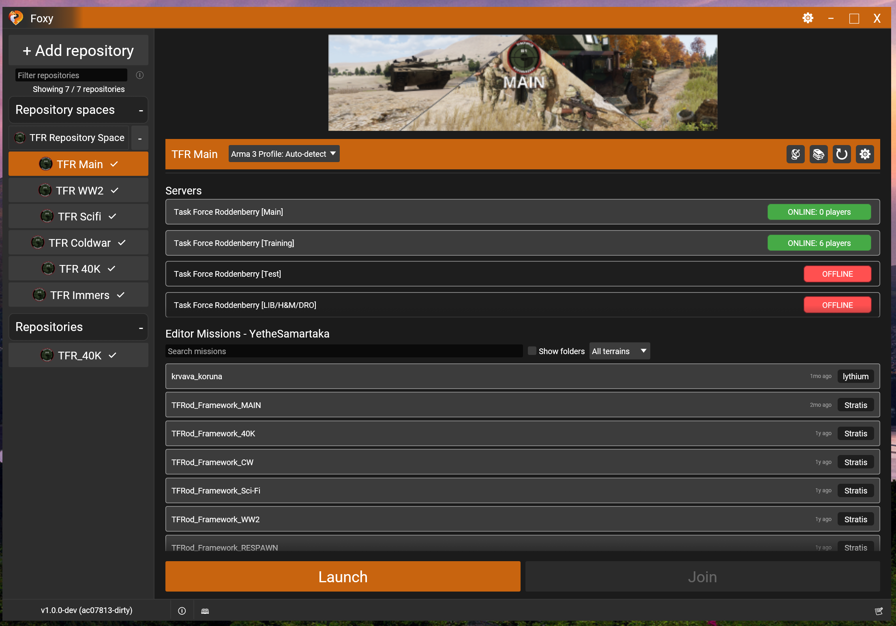
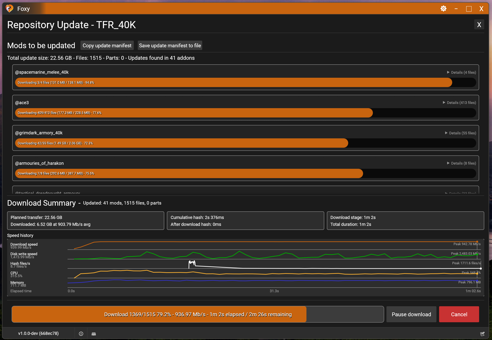
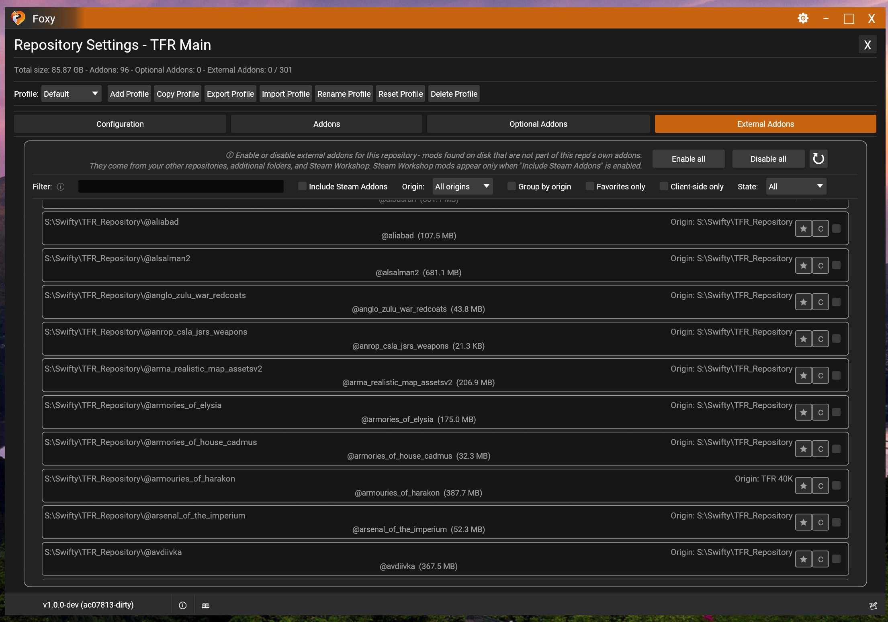

# Foxy

Foxy is a modern repository updater (Intended primarily for Arma 3 from the start) built from the ground up for speed, reliability, and automation.
It ships as a single binary with both a full desktop UI and a scriptable CLI, runs on Windows and Linux (with early experimental macOS support), and is designed to replace legacy updaters without leaving anyone behind.

## Screenshots







## Why Foxy

- **Fast, reliable synchronization** - Foxy keeps Arma 3 repositories up to date with remote refresh, quick checks, rechecks, filesystem drift detection, and tree-hash verification. FoxyMode uses BLAKE3 for fast local hashing while preserving MD5 compatibility for legacy Swifty repositories.
- **Bandwidth-saving updates** - Delta patching downloads only changed file parts, validates the result, and automatically falls back to a full-file download if patching cannot be completed safely.
- **Repository and profile management** - Manage multiple repositories, repository spaces, visual folders for grouping/coloring/collapsing repositories, launch profiles, optional addons, external addons, backups, drag-and-drop ordering, and bulk sync operations with selective include/exclude filtering.
- **Arma 3 integrations** - Detect Steam and the Arma 3 installation automatically, manage Arma 3 profiles (detect, rename, clone, delete), recognize Steam Workshop addons, validate TeamSpeak 3 and Steam before launch, and support server quick-join flows with repo-provided launch parameters and DLC metadata.
- **Daily workflow tools** - Repository filtering, addon file search, editor mission scanning, mission open/duplicate/delete actions, dependency cleanup, scheduled rechecks, automatic downloads, and optional post-job close or shutdown actions are available from the app.
- **Clear update visibility** - Download screens show per-addon progress, update summaries, toast notifications, transfer history graphs, adaptive speed limits, and grouped download/disk/hash performance metrics.
- **Game spaces** - Each supported game gets its own workspace with separate settings, repositories, stores, and database, switchable at runtime and remembered across launches. Arma 3 is the reference module; Total War: WARHAMMER III and Arma Reforger modules ship alongside it, with their mod management and launch currently driven from the CLI.
- **Migration and direct-download workflows** - Guided Swifty migration preserves repositories and spaces, while direct-download mode can fetch repository, addon, or file URLs without a full database sync.
- **One binary, two interfaces** - The same `Foxy` executable provides the desktop UI and a scriptable CLI with `--json`, `--dry-run`, `--yes`, `--quiet`, and `--no-progress` support for automation and accessible output.
- **Cross-platform app delivery** - Native Windows and Linux builds include platform-appropriate installers plus decentralized in-app updates from self-hosted manifests or GitHub Releases, with early experimental macOS builds.
- **Customizable, accessible UI** - Themes support import/export, presets, scaling, and toast feedback. Keyboard navigation, locale-aware formatting, scalable fonts, clear status messages, and non-color-only indicators are built in.
- **Broad localization** - Built-in localization bundles cover `en`, `ar`, `bg`, `bn`, `cs`, `da`, `de`, `el`, `es`, `et`, `fa`, `fi`, `fr`, `he`, `hi`, `hr`, `hu`, `id`, `it`, `ja`, `ko`, `lt`, `lv`, `nb`, `nl`, `pl`, `pt`, `pt-BR`, `ro`, `ru`, `sk`, `sl`, `sr`, `sv`, `th`, `tl`, `tr`, `uk`, `ur`, `vi`, and `zh`.

Current workspace status:
- Main app crate: `Foxy` (Rust `1.96`, edition `2024`)
- Companion crate: `foxy-server-backend-cli` (repository generation + app updater manifest tooling)
- UI stack: `egui` / `eframe`
- Core/data stack: `Turso` (pure-Rust, async, SQLite-compatible engine)

## Future roadmap

These are planned directions for Foxy. They are not listed in any particular order, and priorities may change.

- Desktop UI for the Steam Workshop, Reforger addon, extra-file, and config-pack tools that are currently CLI-only
- Game-space-level profiles that carry a config folder and extra-file selection, for games that do not use repositories
- Authentication support
- Server mode - reuse Foxy's launch and addon management systems to set up, update, and manage dedicated servers
- Further game modules on top of the existing game-space framework

## Installation

### Pre-built installers

Download the latest release from the repository Releases page.

- Windows: run `Foxy-<version>-setup.exe`
- Linux user install: run `chmod +x Foxy-<version>-linux-x86_64-installer.sh && ./Foxy-<version>-linux-x86_64-installer.sh --prefix="$HOME/.local/opt/foxy"`
- Linux system install: run `chmod +x Foxy-<version>-linux-x86_64-installer.sh && sudo ./Foxy-<version>-linux-x86_64-installer.sh`

Linux in-app updates use Foxy's self-extracting `.sh` installer. System installs may prompt for administrator privileges through `pkexec` when the install prefix is not writable.

### Build from source

Requirements:
- Rust `1.96+` (edition 2024)
- Windows only: `windres` (MinGW resource compiler, used by `build.rs`)

Main app:
```bash
cargo build --release
```

Workspace (main app + server backend CLI):
```bash
cargo build --workspace --release
```

Pre-release build (release-optimized, version label and logs carry source commit):
```bash
cargo prerelease
```

Build installers:
```bash
# Windows
scripts\build-windows-installer.bat

# Linux
./scripts/build-linux-installer.sh
TARGET=aarch64-unknown-linux-gnu ./scripts/build-linux-installer.sh

# macOS Apple Silicon, local experimental build
./scripts/build-macos-installer.sh
```

Native Windows-to-macOS installer builds are not supported by this repo. The macOS dmg path needs macOS SDK/linker support and `hdiutil`. From Windows, use an SSH-accessible Mac and copy the dmg back:
```powershell
pwsh scripts\build-macos-installer.ps1 -RemoteHost user@mac-host -RemoteRepoPath /Users/user/Foxy
```

Linux cross-build from Windows (Docker/Podman):
```bash
cargo install cross
cross build --release --target x86_64-unknown-linux-gnu
```

Native Linux dependencies (Ubuntu/Debian example):
```bash
sudo apt-get install -y pkg-config libssl-dev libgtk-3-dev \
  libx11-dev libxi-dev libxrandr-dev libxinerama-dev libxcursor-dev \
  libxkbcommon-dev libwayland-dev libudev-dev libasound2-dev \
  libgl1-mesa-dev libxcb-render0-dev libxcb-shape0-dev libxcb-xfixes0-dev
cargo build --release
```

## CLI Usage

Behavior:
- Desktop launch (or no-arg non-terminal launch) opens UI
- Terminal no-arg launch prints CLI help in release builds
- Debug builds open UI on no-arg launch for faster iteration
- `foxy ui` (or `foxy ui --debug-mode`) explicitly launches UI from terminal
- `foxy ui --debug-modal <app-update|db-schema-wipe>` opens a startup modal with placeholder data for inspection (repeatable); the modal's real actions stay disabled

### Global flags

| Flag | Description |
|------|-------------|
| `--config-dir <path>` | Override config root directory |
| `--json` | Emit machine-readable JSON output |
| `--quiet` | Reduce informational output |
| `--no-progress` | Disable live progress output |
| `--yes` | Confirm destructive operations |
| `--dry-run` | Preview behavior without writing changes |

### Commands

| Command | Description |
|---------|-------------|
| `ui` | Launch desktop UI |
| `version` | Print Foxy version |
| `settings show\|set\|reset` | Inspect/modify settings |
| `repo list\|add\|remove\|clone\|sync\|wipe-db\|force-redownload` | Repository operations |
| `sync` | Alias of `repo sync` |
| `addon list\|set\|recalc-hashes\|force-redownload` | Addon operations |
| `profile list\|select\|add\|delete` | Profile operations |
| `space list\|sync` | Repository space operations |
| `direct-download` | Download by URL without full sync |
| `launch` | Build or execute Arma 3 launch command |

Examples:
```bash
foxy version --json
foxy repo list --json
foxy repo sync --repo-url https://example/repo/ --mode quick-check
foxy sync --repo-name "My Repo" --mode remote-refresh
foxy direct-download --address https://example.com/file.zip --dest /tmp --limit-mbps 25
foxy launch --repo-name "My Repo" --server "My Server" --execute
```

## Configuration Data

Foxy stores runtime/config data under the config root:

| File/Dir | Purpose |
|----------|---------|
| `settings.json` | App settings |
| `repositories.json` | Repository definitions |
| `repository_spaces.json` | Repository space definitions |
| `window_state.json` | Window geometry/state |
| `database.db` | Turso (SQLite-compatible) database state |
| `images/` | Cached images |
| `logs/` | Application logs |
| `backups/` | Backup storage |

Default locations:
- Windows: `%APPDATA%\Foxy`
- Linux: `~/.config/Foxy`

Overrides:
- Environment variable: `FOXY_CONFIG_DIR`
- CLI flag: `--config-dir`

## Swifty Compatibility

Foxy supports legacy Swifty repositories and can validate against MD5-based remote checksums where required. For server-side generation/migration, use `foxy-server-backend-cli`.

Generation modes:

| Mode | Flag | Output |
|------|------|--------|
| Foxy mode (default) | `--mode foxy` | BLAKE3 + `foxy_addon.json` / `foxy_addons.json` |
| Swifty mode | `--mode swifty` | MD5 + `mod.srf` |
| Hybrid mode | `--mode hybrid` | Both artifact sets side by side |

## Foxy Server Backend CLI

Build:
```bash
cd foxy-server-backend-cli
cargo build --release
```

Repository generation:
```bash
foxy-server-backend-cli new config.json
foxy-server-backend-cli create config.json ./output
foxy-server-backend-cli create config.json ./output --mode swifty
foxy-server-backend-cli create config.json ./output --mode foxy
foxy-server-backend-cli create config.json ./output --mode hybrid
foxy-server-backend-cli create config.json ./output --app-update-url https://example.com/foxy-app-updater.json
```

`create` finishes by printing the server `-mod=` line for the generated repository,
so a wrapper script can feed it straight into a server parameters file:

```bash
foxy-server-backend-cli create config.json ./output --mod-line-prefix mods
# Server mod line:
# -mod=ws;mods/@cba_a3;mods/@ace;
```

Creator DLC codes from `dlcContent` come first, then the enabled required mods.
Client-side mods are always excluded; add `--mod-line-include-optional` to append
the optional mods as well.

App update manifest flow:
```bash
foxy-server-backend-cli setup-app-updater \
  --version 1.0.0 \
  --windows-installer ./installers/Foxy-1.0.0-setup.exe \
  --linux-installer ./installers/Foxy-1.0.0-linux-x86_64-installer.sh \
  --linux-aarch64-installer ./installers/Foxy-1.0.0-linux-aarch64-installer.sh \
  --changelog ./CHANGELOG.md \
  --output ./server-root

foxy-server-backend-cli new-app-update \
  --version 0.8.1 \
  --windows-installer ./installers/Foxy-0.8.1-setup.exe \
  --linux-installer ./installers/Foxy-0.8.1-linux-x86_64-installer.sh \
  --linux-aarch64-installer ./installers/Foxy-0.8.1-linux-aarch64-installer.sh \
  --changelog ./CHANGELOG.md \
  --output ./server-root
```

## Validation

```bash
cargo fmt
cargo clippy --all-targets --all-features -- -D warnings
cargo test --workspace
```

## Contributing

1. Keep diffs small and reviewable.
2. Match existing style and architecture.
3. Run format/lint/tests before opening PRs.
4. Update `src/ui/locales/en.json` for user-facing text changes; translate other locale files only when explicitly requested.
5. Prefer incremental, reversible changes over broad refactors.

## Known issues

### NVIDIA overlay on startup

NVIDIA GeForce Experience / NVIDIA App may display its in-game overlay every time Foxy launches. This happens because NVIDIA classifies any DirectX 12 or Vulkan application as a potential game, and there is no supported NVIDIA API for an application to opt out.

Foxy is a desktop application, not a game, so the overlay is safe to exclude without losing any functionality:

- Open NVIDIA App, go to Settings, find the in-game overlay or Games and Apps section, and add Foxy to the excluded applications list.
- Or disable the NVIDIA in-game overlay globally if you do not use features like instant replay, screenshots, or recording.

Other overlays (Discord, Steam, Bandicam, OBS, Xbox Game Bar) can be excluded similarly. See the in-app Help view, Third-party overlays tab, for per-tool steps.

## Notes

- `CHANGELOG.md` tracks user-facing changes.
- `AGENTS.md` contains coding and review conventions for this repository.
- `LICENSE` contains the project license shown in the app's About view.

## Authors

- [YetheSamartaka](https://github.com/YetheSamartaka)
- [Sognus](https://github.com/Sognus)

## Acknowledgements

Huge thanks to the Task Force Roddenberry community for giving Foxy the opportunity to grow through real-world use, feedback, and testing.

- [Task Force Roddenberry](https://www.tfrod.cz/)

## DeepWiki
You can use DeepWiki to better understand this repo.

[![DeepWiki](https://img.shields.io/badge/DeepWiki-YetheSamartaka--Foxy%2FFoxy-blue.svg?logo=data:image/png;base64,iVBORw0KGgoAAAANSUhEUgAAACwAAAAyCAYAAAAnWDnqAAAAAXNSR0IArs4c6QAAA05JREFUaEPtmUtyEzEQhtWTQyQLHNak2AB7ZnyXZMEjXMGeK/AIi+QuHrMnbChYY7MIh8g01fJoopFb0uhhEqqcbWTp06/uv1saEDv4O3n3dV60RfP947Mm9/SQc0ICFQgzfc4CYZoTPAswgSJCCUJUnAAoRHOAUOcATwbmVLWdGoH//PB8mnKqScAhsD0kYP3j/Yt5LPQe2KvcXmGvRHcDnpxfL2zOYJ1mFwrryWTz0advv1Ut4CJgf5uhDuDj5eUcAUoahrdY/56ebRWeraTjMt/00Sh3UDtjgHtQNHwcRGOC98BJEAEymycmYcWwOprTgcB6VZ5JK5TAJ+fXGLBm3FDAmn6oPPjR4rKCAoJCal2eAiQp2x0vxTPB3ALO2CRkwmDy5WohzBDwSEFKRwPbknEggCPB/imwrycgxX2NzoMCHhPkDwqYMr9tRcP5qNrMZHkVnOjRMWwLCcr8ohBVb1OMjxLwGCvjTikrsBOiA6fNyCrm8V1rP93iVPpwaE+gO0SsWmPiXB+jikdf6SizrT5qKasx5j8ABbHpFTx+vFXp9EnYQmLx02h1QTTrl6eDqxLnGjporxl3NL3agEvXdT0WmEost648sQOYAeJS9Q7bfUVoMGnjo4AZdUMQku50McDcMWcBPvr0SzbTAFDfvJqwLzgxwATnCgnp4wDl6Aa+Ax283gghmj+vj7feE2KBBRMW3FzOpLOADl0Isb5587h/U4gGvkt5v60Z1VLG8BhYjbzRwyQZemwAd6cCR5/XFWLYZRIMpX39AR0tjaGGiGzLVyhse5C9RKC6ai42ppWPKiBagOvaYk8lO7DajerabOZP46Lby5wKjw1HCRx7p9sVMOWGzb/vA1hwiWc6jm3MvQDTogQkiqIhJV0nBQBTU+3okKCFDy9WwferkHjtxib7t3xIUQtHxnIwtx4mpg26/HfwVNVDb4oI9RHmx5WGelRVlrtiw43zboCLaxv46AZeB3IlTkwouebTr1y2NjSpHz68WNFjHvupy3q8TFn3Hos2IAk4Ju5dCo8B3wP7VPr/FGaKiG+T+v+TQqIrOqMTL1VdWV1DdmcbO8KXBz6esmYWYKPwDL5b5FA1a0hwapHiom0r/cKaoqr+27/XcrS5UwSMbQAAAABJRU5ErkJggg==)](https://deepwiki.com/YetheSamartaka-Foxy/Foxy)

## License

Foxy is public source-available software under the [Foxy Community Source License 1.0.0](LICENSE). It is not an OSI open-source license. You may read the source, run Foxy for noncommercial purposes, make private noncommercial changes, and create contribution-focused forks, but commercial use and independent public distributions require separate permission while the official project is actively maintained.

For a practical summary of what is allowed, see [LICENSING.md](LICENSING.md).
